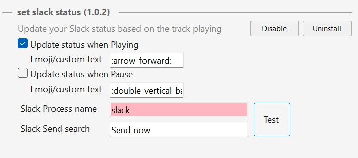

# :tada: Set Slack Status 1.0.0

Tested under Win10/Win11 x64 - Required [MusicBee 3.x](https://www.getmusicbee.com/) and [.NET 4.5](https://www.microsoft.com/en-ca/download/details.aspx?id=30653)

* mb_setSlackStatus-1.0.0.zip

## Directions:

* :package: Unpack **mb_setSlackStatus-1.0.0.zip** contents into Musibee's **plugins** folder.
    * If using MSI Installer, probably: C:\Program Files (x86)\MusicBee\Plugins\
* :wrench: Open the plugin Settings and configure a valid **Channel name** in the **Slack Channel Search** Textbox.

* :point_right: Click the **Test** button. Expected result: all three Textboxes should be green.

### Example when Test has passed

### Example when Test has failed (i.e. Slack not running or wrong Channel name)

* :point_right: Then click **Save** to save your changes.
* :musical_note: Enjoy it :wink:

### MusicBeePortable_3_4_custom.zip

My Company's Advanced Malware Protection (AMP) is flagging the MSI installer and also the Portable version. So,
I've downloaded the [portable](https://www.getmusicbee.com/) version and manually [updated](https://www.un4seen.com/) the culprit files, listed bellow:

**bassasio.dll** : 1.4.0.2  => 1.4.1.0

**bassenc.dll**  : 2.4.14.0 => 2.4.15.0